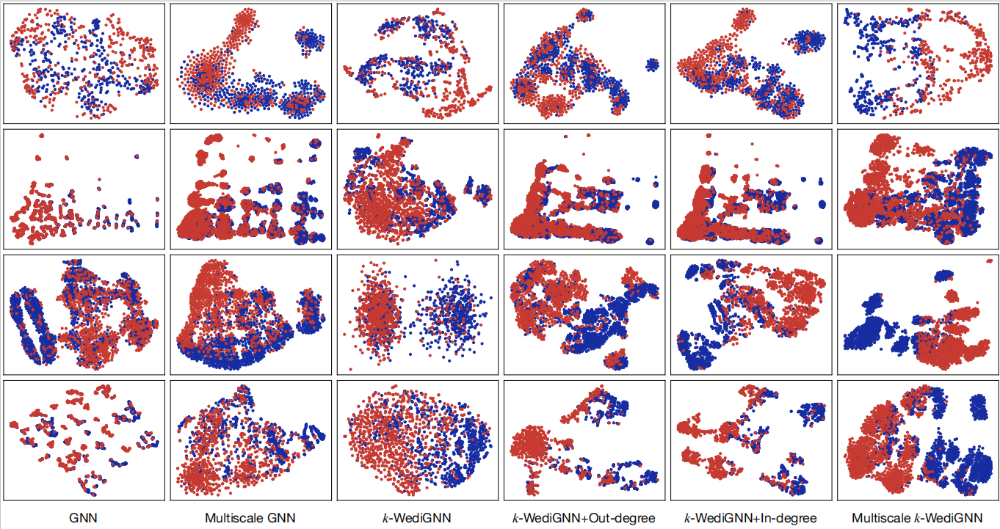

# Multiscale Weisfeiler-Leman Directed Graph Neural Networks for Prerequisite-Link Prediction
Authors: Yupei Zhang IEEE Member, Xiran Qu, Shuhui Liu, and Xuequn Shang
## Overview
>  Prerequisite-link prediction (PLP) aims to discover the condition relations of a specific event or a concerned variable, which is a fundamental problem in a large number of fields, such as education data mining. Current studies on PLP usually developed graph neural networks (GNNs) to learn the representations of pairs of nodes. However, these models fail to distinguish non-isomorphic graphs and integrate multiscale structures, leading to the insufficient expressive capability of GNNs. To this end, we in this paper proposed *k*-dimensional Weisferiler-Leman directed GNNs, dubbed *k*-WediGNNs, to recognize non-isomorphic graphs via the Weisferiler-Leman algorithm. Furthermore, we integrated the multiscale structures of directed graphs into *k*-WediGNNs, dubbed multiscale *k*-WediGNNs, from the bidirected views of in-degree and out-degree. With the Siamese network, the proposed models are extended to address the problem of PLP. Besides, their expressive powers are analyzed through promising proofs. The experiments were conducted on four publicly available datasets for concept prerequisite relation prediction. The results show that the proposed models achieve better performance than the state-of-the-art methods, where the multiscale *k*-WediGNN reaches the best performance among all compared models.
## Multiscale *k*-WediGNN

## The Used Datasets
> Experiments were performed on four knowledge component (KC) datasets, encompassing diverse subject areas from both online and offline courses. These datasets include:
> - DSA
> - ML
> - LectureBank
> - University Courses
## Dependencies
>The code requires Python >= 3.9 and PyTorch >= 1.10.1.
>More details of the environment dependencies required for code execution can be found in the `requirements.txt` file within the repository.
## Experiment
> To showcase the superiority, we compared our methods with the traditional binary classification models developed in CPRP,including Support Vector Machine (SVM), Naive Bayes (NB),, and as well as the state-of-the-art approaches, including:
> - Graph Autoencoder (GAE) and Variational Graph Autoen-coder (VGAE).
> - Reference Distance (RefD).
> - Prerequisite Prediction (PREREQ).
> - Concept Prerequisite Relation Learning (CPRL).
> - Contextual-knowledge-aware approach (Conlearn).
  
> To investigate the improved discrimination, we canceled some components of multiscale k-WediGNNs as the references:
> - GNN
> - Multiscale GNN
> - k-WediGNN
> - k-WediGNN+Out-degree
> - k-WediGNN+In-degree
##  Visualizations
> Below is a diagram illustrates all scatter diagrams of combined representations of pairs of nodes [*v**p* : *v**q*] learned on the four datasets.

The 1st, 2nd, 3rd, and 4th rows present the scatter results on DSA, ML, LectureBank, and University Courses,respectively. Columns correspond to different methods. Red points indicate the negative sample, while blue points are the positive samples.

> The following figure visualizes the 2D representations of the directed linksand their inverse links. For each positive sample [*v**p* : *v**q*], we plotted [*v**p* : *v**q*:*v**p*—*v**q*]and [*v**q* : *v**p*:*v**q*—*v**p*] to investigate whether the learned features can predict the direction correctly.

## Concept Prerequisite Relation Prediction
> Table I lists all evaluation results of various methods on the four used datasets.From Table I , we can draw the conclusion that the GNN-based
methods, including CPRL, ConLearn, and Ours, can result in
better performance, benefiting from graph-structure features;
Multiscale k-WediGNN achieves the best overall performance,
benefiting from the more expressive power via the integration
of topological features and multiscale features.

Table II shows the evaluation results of ablation studies on the four datasets.As is shown, k-WediGNN gains significant
improvements with respect to GNN, manifesting the effectiveness of the topological features;
Fig. 5. Receiver operating characteristic (ROC) curves of the ablation studies
on four datasets. The areas under the ROC curves (AUCs) are then computed.
ness of the topological features;

Below is a diagram shows the ROC curves together with their AUC values
of the ablation studies on the four datasets. From the results,
we can find that GNN produces the lowest ROC curves on all
datasets, while Multiscale GNN obtains improvements in both
ROC and AUC; the methods of integrating the WL algorithm
into GNN result in better performance consistently; Multiscale
*k*-WediGNN gives the best performance in terms of the highest
ROCs and AUCs. These results consolidate that the proposed
strategy can enhance directed link prediction, delivering state-of-the-art CPRP performance.
  
These aforementioned results substantiate the efficacy of our research.
##  Tips
> The complete code will be uploaded to the repository in a subsequent update.

 
